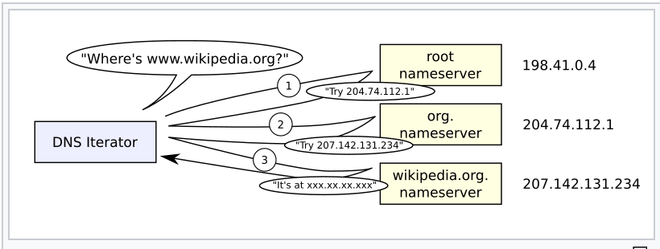
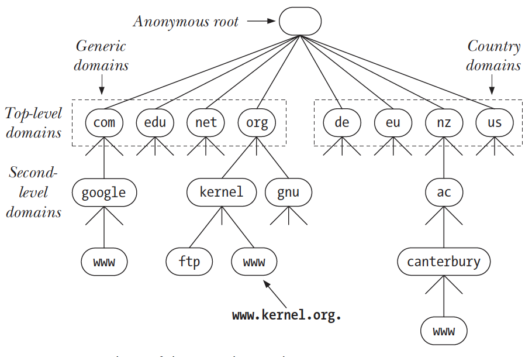

## 実行方法

```
g++ -Wall -std=c++17 -L/usr/local/opt/openssl/lib -o Application Application.cpp WebScraper.cpp -lcrypto -lssl
```

## 何が学びたいか

1. Concureency
2. C++
3. Regrex
4. Socket
5. Logger
6. Network flow

## Logger

### どのような方法があるか
- static method
- static class
- in-class

今回はstatic methodで実装

### static method
- 利点
    1. Instanceが生成されるたびに、メモリを食わない（コードのところにあるものを呼び出してくるだけ）
- 欠点
    1. どのクラスから呼ばれたものかを表現することができない
        - thisなどでObjectの情報を渡したくてもそのメソッドはstaticであることから、情報を入れることができない

## Network flow

### sequnece
1. Client側でアドレスをBrowserに入れて移動
2. アドレスではわからないので、DNSサーバーからアドレスに対するIPアドレスを貰う
3. 2でもらったIPアドレスからサイトに接続をする
4. TCPの3Hand Shakeを行う（send_ACK = receive_SYN+1）
5. 接続！

### DNS Server

#### What

人間が理解しやすいアドレスに対して実際のIPアドレスが何かを検索し返すことで、クライアントに実際の接続先のIPアドレスがわかるようにする

#### Why

gethostbyname()は

```/etc/hosts```

からIP addressとhost nameのマッピングデータを収集していたが、ネットワークが膨大になるにつれこれにデータを集めておくことは容量などの問題があるから

> DNSサーバーはローカルにこの情報を置かなくてもdomain nameからIP addressがわかるようにする。

#### How

- DNS address resolution mechanism



DNS armはDNS hierarchyに基づいてある。Cacheと同じく、ユーザーには容量が多くスピードも速いと感じさせる。

- DNS Hierarchy



```
getaddrinfo(const char *host, const char *service, const struct addrinfo *hints, struct addrinfo **result)
```

**getaddrinfo() function converts host and service names to IP addresses and port numbers**

- host resolution

When a program calls getaddrinfo() to resolve (i.e., obtain the IP address for) a domain name, getaddrinfo() employs a suite of library functions (the resolver library) that communicate with the local DNS server. If this server can’t supply the required information, then it communicates with other DNS servers within the hierarchy in order to obtain the information. Occasionally, this resolution process may take a noticeable amount of time, and DNS servers employ caching techniques to avoid unnecessary communication for frequently queried domain names.

- service resolution

The getaddrinfo() and getnameinfo() functions use the information in /et c/services to convert service names to port numbers and vice versa.

### HTTP/HTTPS

#### Location Header

Response headerとして、現在参照されたものがどこにあるかを表すHeaderとなる→Redirect先を指す

#### SSL/TLS

```
   Client                                           Server

Key  ^ ClientHello
Exch | + key_share*
     | + signature_algorithms*
     | + psk_key_exchange_modes*
     v + pre_shared_key*       -------->
                                                  ServerHello  ^ Key
                                                 + key_share*  | Exch
                                            + pre_shared_key*  v
                                        {EncryptedExtensions}  ^  Server
                                        {CertificateRequest*}  v  Params
                                               {Certificate*}  ^
                                         {CertificateVerify*}  | Auth
                                                   {Finished}  v
                               <--------  [Application Data*]
     ^ {Certificate*}
Auth | {CertificateVerify*}
     v {Finished}              -------->
       [Application Data]      <------->  [Application Data]

            +   Indicates noteworthy extensions sent in the
                previously noted message.

            *   Indicates optional or situation-dependent
                messages/extensions that are not always sent.

            {}  Indicates messages protected using keys
                derived from a [sender]_handshake_traffic_secret.

            []  Indicates messages protected using keys
                derived from [sender]_application_traffic_secret_N.
```

-   Key Exchange: Establish shared keying material and select the
    cryptographic parameters.  Everything after this phase is
    encrypted.

-   Server Parameters: Establish other handshake parameters
    (whether the client is authenticated, application-layer protocol
    support, etc.).

-   Authentication: Authenticate the server (and, optionally, the
    client) and provide key confirmation and handshake integrity.